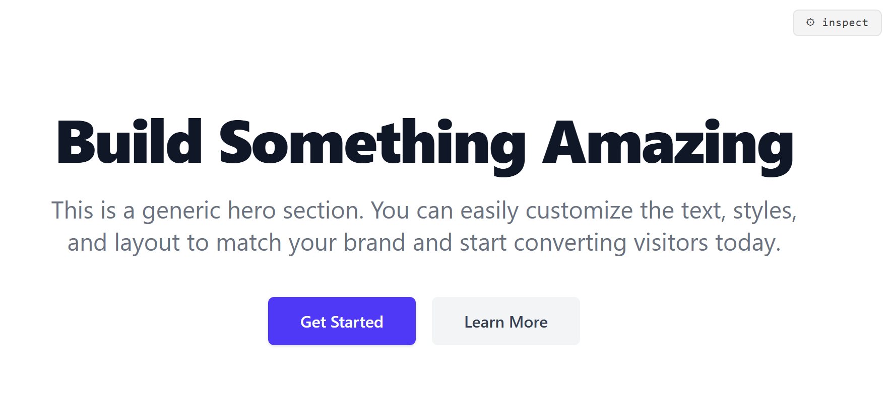
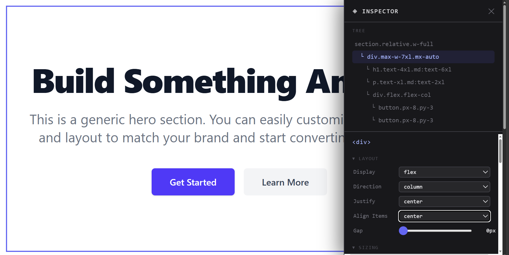

# React-Design-Helper

> A work-in-progress React dev helper, inspect and live-tweak your UI without leaving the browser.

## What is this?

Working with Three.js, you get helpers that output live camera positions so you can tweak values in real time and bake them into your code. This project brings that same idea to React.

Instead of jumping to Figma, opening DevTools, or digging through computed styles, you drop an `<EditHelper />` component into any section and get an inline inspector panel that lets you select elements, read their styles, and edit them live.

## How it works

All you need is the component in this project called EditHelper.tsx.
You add it to your project and just import it in the section you want it edited.

You can check the example on the file App.tsx where we import the component

```
import { EditHelper } from './components/EditHelper'
```

then we add the component into the section we want edited. 

```
function App() {
  return (

    <>
      <section className="relative w-full min-h-screen bg-white flex items-center justify-center border-b border-gray-200">

        <EditHelper />

      </section>
    <>

```

You can add `<EditHelper />` inside multiple sections no extra setup needed:

```tsx
<section className="...">
  <EditHelper />
  <div>...</div>
</section>
```

Click **⚙ inspect** → a panel slides in from the right with:

- **Element tree** — every child element listed with indentation, click any to select it
- **Live highlight** — selected element gets a purple outline on screen
- **Property groups** — contextual controls for the selected element:
  - Layout (display, flex direction, justify, align, gap)
  - Sizing (width, height, max-width, min-height)
  - Padding / Margin
  - Typography (font size, weight, line height, text align, tracking)
  - Colors (background, text)
  - Border (radius, width, color)
  - Effects (opacity, box shadow)

All changes apply instantly as inline styles. Drop it in any section, tweak, close when done.

## Examples





## Stack

- React + TypeScript
- Tailwind CSS
- Vite

## Status

Work in progress. Current focus is the `EditHelper` inspector component.
